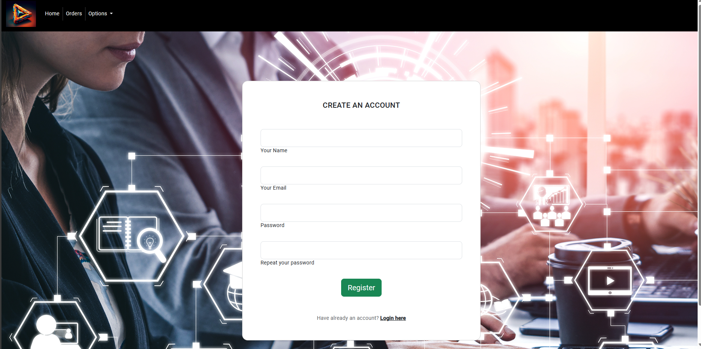

# AngularProject
### Tech-Shop

This is a front-end project built using the Angular framework.

## Over View 

## Getting Started

These instructions will get you a copy of the project up and running on your local machine for development and testing purposes.

### Prerequisites

What things you need to install the software and how to install them:

- Node.js
- Angular CLI
- JSON-Server

### Installing

A step by step series of examples that tell you how to get a development environment running:

1. Clone the repo
2. Install NPM packages: `npm install`
3. Install JSON-Server: `npm install -g json-server`
4. Start JSON-Server: `json-server --watch db.json`

## Deployment

Add additional notes about how to deploy this on a live system.

## Built With

- Angular - The web framework used
- JSON-Server - Used to create a REST API and database

## OverView

